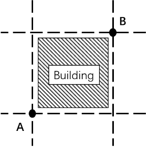
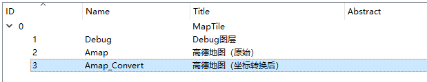
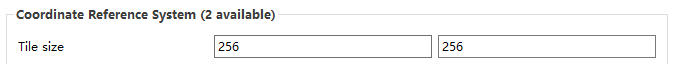
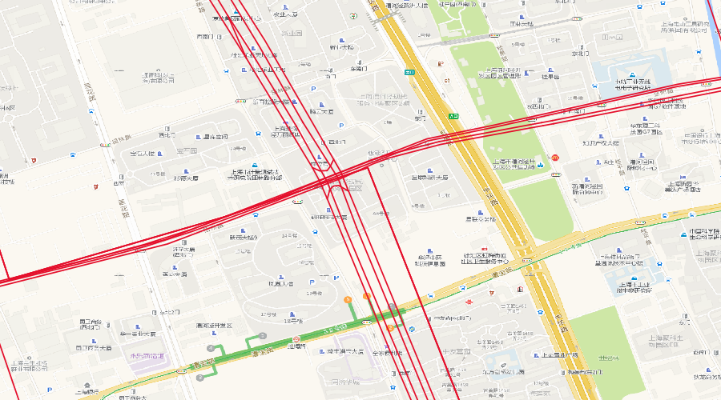
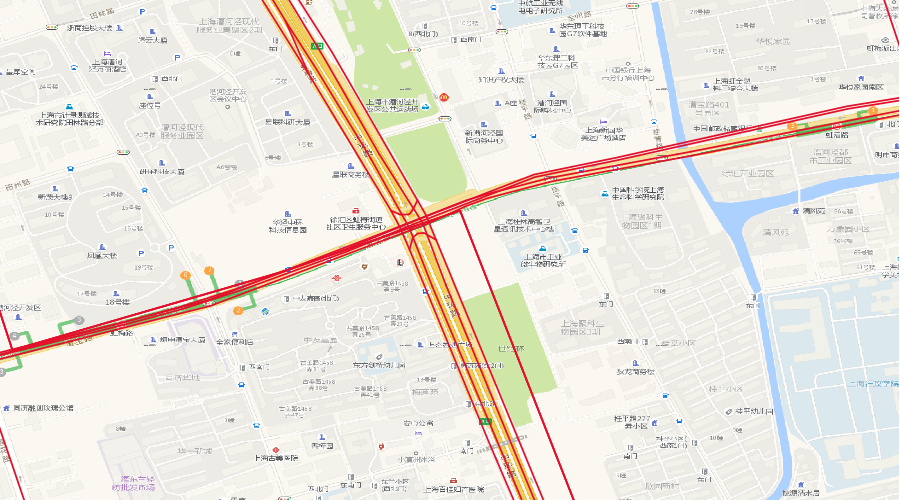

# WebMap2WMS

## 项目简述

### 开发背景
当开发一个项目需要对比多家互联网地图的数据时，往往需要调用多家地图服务的接口，为了简化开发过程，需要能够将不同互联网地图服务以图层的形式
方便的加载。

为此，本项目将借助MapBox的SDK，将其他地图服务包装成WMS的形式，以图层的形式加载到地图控件中。同时这样做的好处还有，能够在QGIS，ArcGIS等主流GIS软件中加载互联网地图，不过也就是能看看，除此之外没啥用。

### 实现流程

将互联网地图服务包装成WMS的流程就是：
1. 地图控件/GIS软件得到用户输入的WMS地址。
2. 地图控件/GIS软件向WMS请求切片，并发送参数。
3. 服务端收到请求，参数中包含了需要的切片的坐标，切片尺寸等信息。
4. 服务端根据坐标向地图服务商请求到对应的切片。
5. 将从地图服务商处得到的切片进行裁剪，拉伸等操作。
6. 返回图像给请求方。

### 意外收获
对于真实世界中的建筑物，道路等要素，经过数据采集加工等一系列的流程后，最终被绘制成切片，展示在用户面前。



一栋A，B点之间的建筑物如图所示，绘制在切片中。

当地图服务商将数据加入偏移后，如果只是单独使用其中一家的数据源，偏移的影响不大，但如果将多家源的数据混合使用时，会存在数据集间偏移的问题。往往这样的偏移是非线性的，无法通过给坐标加上定值来解决。

但是地图服务商为了保证地图的可用性，在小范围内，偏移必然要能够近似线性。（下班了，未完待续）

## 已有结论

**当一家互联网地图服务提供接口1时，能够将其包装成WMS服务，接口1，2都提供时，可以将其加密后的地图切片近似还原到加密前：**

1. **提供根据指定的坐标范围返回地图切片的接口。**

2. **提供将原始坐标转换为加密后的坐标的接口。**

对于接口1而言，大多数互联网地图不会直接提供这样的接口，此时需要利用静态地图的接口或者通过抓包并分析来得到切片接口。

对于接口2而言，大多数互联网地图是提供这样的接口的。

## 如何使用

### 1，添加高德的key

请自行注册一个能够调用高德WebAPI的key，替换到`settings.py`文件内。

### 2，启动服务

```
cd servicescode
python manage.py runserver 0.0.0.0:8011
```
### 3，加载图层

在`QGIS`中选择`Add WMS/WMTS Layer`,新建一个WMS连接,URL填写
```
http://127.0.0.1:8011/debug?bbox={bbox-epsg-4326}&version=1.1.1&srs=EPSG:4326
```
即可。注意端口号与启动服务的命令统一。加载后如图所示：



* `Debug`图层返回的是用于调试的地图切片，显示一些由`QGIS`发送给WMS的参数。
* `Amap`图层返回的是原始的高德地图切片，与官网上的相似，保留了偏移效果。
* `Amap_Convert`图层返回的是纠偏后的高德地图切片，在大比例尺下的纠偏效果明显。

### 4，指定切片大小



此处不指定切片的大小也能够正常显示。但是由于高德接口的限制，通过提供的API获取到的每张切片的大小不超过`1024*1024`，如果在后台实现拼接算法，可以突破这一限制。

所以建议此处填写`256*256`或者`512*512`。

### 5，最终效果

红色的线为`OSM`的数据，如何加载请自行解决。

* `Amap`图层与`OSM`数据，未纠偏：



* `Amap_Convert`图层与`OSM`数据，已纠偏：



## 存在的问题

1. 仅能够获取到切片底图，本项目的可用性受限制。
2. 目前利用WMS，加载图层时只能一个一个的添加，不能多选。
3. 获取大范围的切片时，本文档的纠偏方法效果不明显。
4. 在MapInfo中加载本服务会出错。